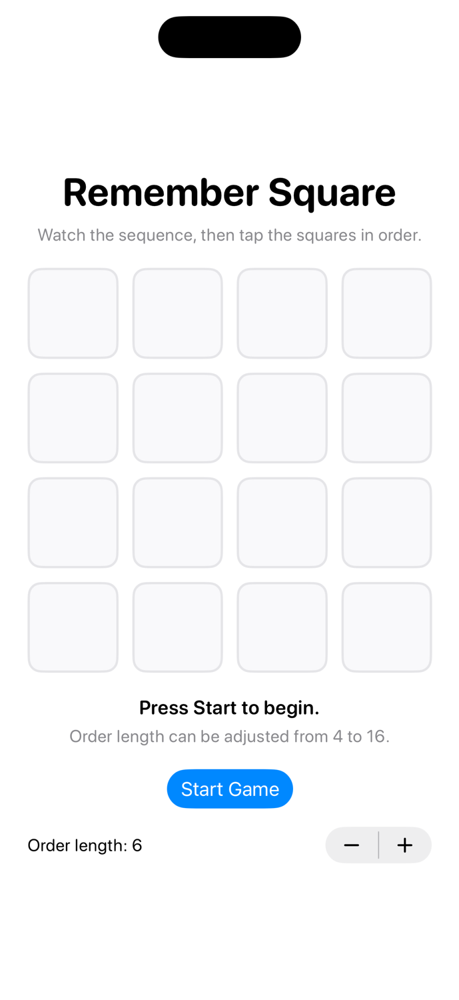
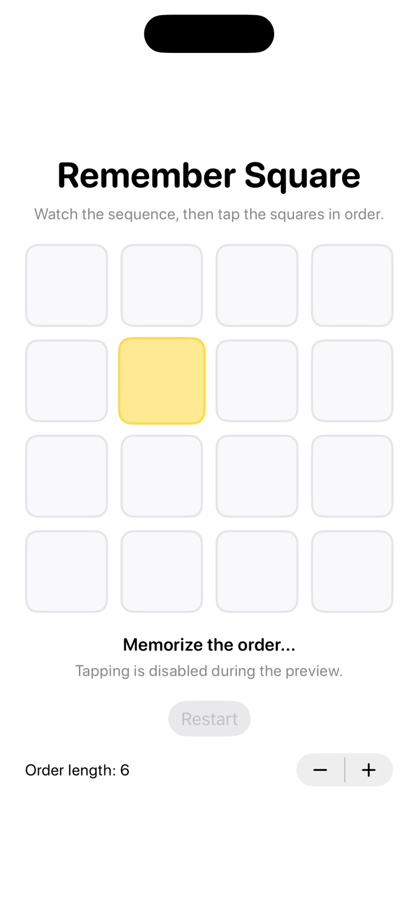
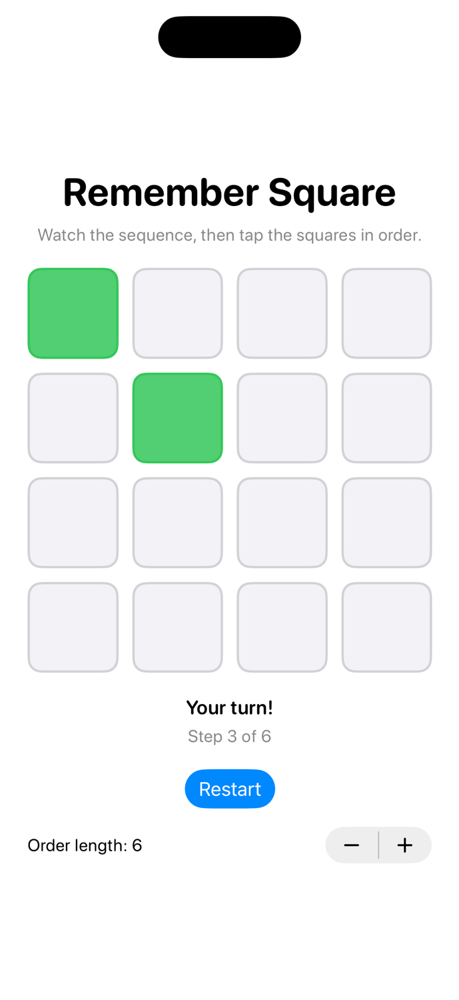
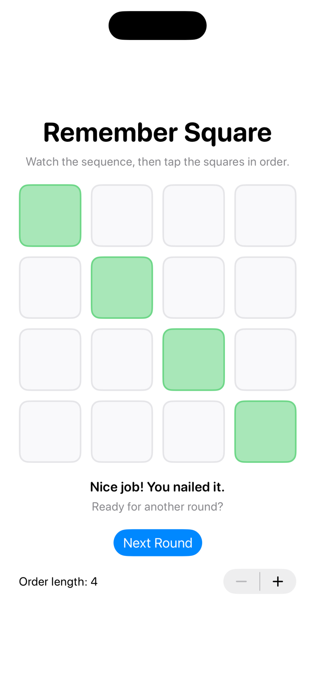
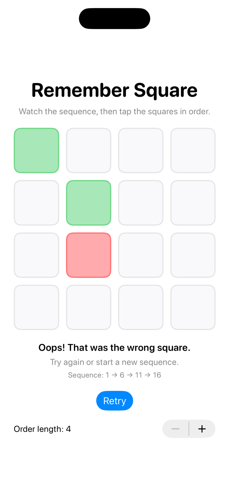
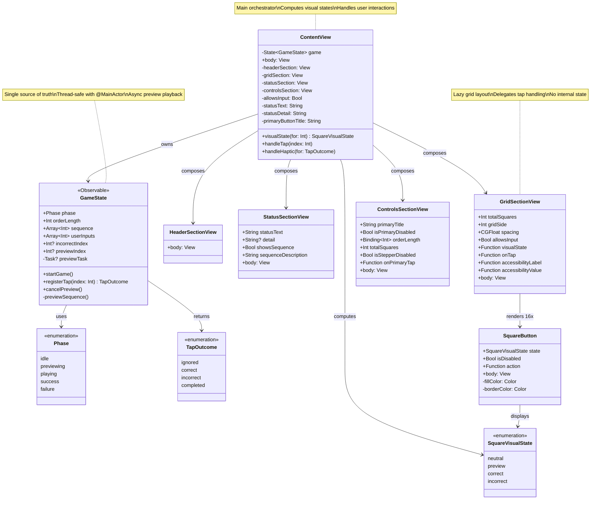
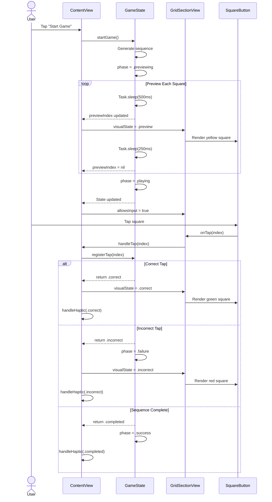

# RememberSquare

> A SwiftUI memory challenge game that tests your pattern recognition and recall abilities

RememberSquare is an engaging memory game where you watch a sequence of squares light up on a 4×4 grid, then tap them back in the exact same order. Think Simon Says meets memory mastery – simple to learn, challenging to master!

## ✨ Features

### Gameplay
- **4×4 Interactive Grid** - 16 squares of brain-teasing fun
- **Visual Feedback** - Color-coded states (yellow for preview, green for correct, red for incorrect)
- **Progressive Difficulty** - Adjustable sequence length from 4 to 16 steps
- **Instant Validation** - Know immediately if you're on the right track
- **Haptic Feedback** - Feel every tap with tactile responses

### Technical Highlights
- Built with modern **SwiftUI** and **Swift Concurrency**
- Smooth animations using **Spring physics**
- Full **accessibility support** with VoiceOver labels
- Clean **MVVM architecture** with `@Observable` state management
- Responsive UI that adapts to different screen sizes

## 📱 Requirements
- iOS 26.0+
- Swift 6.2+
- Xcode 16+

## 🚀 Getting Started

1. Clone this repository
2. Open `RememberSquare.xcodeproj` in Xcode
3. Select an iOS 26 simulator or device
4. Hit **⌘R** to build and run
5. Tap **Start Game** and test your memory!

## Screenshots

<table>
 <tr>
  <td align="center">
   
   <br><b>Idle State</b><br>
   <em>Press Start to begin</em>
  </td>
  <td align="center">
   
   <br><b>Preview State</b><br>
   <em>Memorize the order</em>
  </td>
  <td align="center">
   
   <br><b>Playing State</b><br>
   <em>Tap the squares in order</em>
  </td>
 </tr>
 <tr>
  <td align="center">
   
   <br><b>Success State</b><br>
   <em>Nice job! You nailed it</em>
  </td>
  <td align="center">
   
   <br><b>Failure State</b><br>
   <em>Oops! Wrong square</em>
  </td>
 </tr>
</table>

## 🎮 How to Play

1. **Start** - Tap the "Start Game" button
2. **Watch** - A sequence of squares will light up in yellow (preview phase)
3. **Remember** - Memorize the order of the highlighted squares
4. **Repeat** - Tap the squares back in the exact same order
5. **Progress** - Complete the sequence to advance to the next round
6. **Challenge** - Adjust the order length to increase difficulty
Green squares = correct taps ✅  
Red square = wrong tap ❌

## 🏗️ Architecture & Code Structure

This project demonstrates clean SwiftUI architecture with a focus on separation of concerns:

### Architecture Diagram



### Data Flow Diagram

```mermaid
flowchart TB
    User([User Tap]) --> ContentView
    ContentView --> |registerTap| GameState
    GameState --> |TapOutcome| ContentView
    ContentView --> |Haptic| Device[UIImpactFeedbackGenerator]
    
    StartButton([Start Button]) --> |startGame| GameState
    GameState --> |Update phase| ContentView
    GameState --> |previewSequence| AsyncTask[Task.sleep Preview]
    AsyncTask --> |Update previewIndex| GameState
    
    GameState -.->|@Observable| ContentView
    ContentView --> |Computed States| Sections[Section Views]
    Sections --> |Visual State| SquareButton
    
    style GameState fill:#90EE90
    style ContentView fill:#87CEEB
    style User fill:#FFD700
    style StartButton fill:#FFD700
    style Device fill:#FFA500
```

### Component Interaction Flow



### Core Components

- **`GameState.swift`** - Observable game logic and state management
  - Manages game phases (idle, previewing, playing, success, failure)
  - Handles sequence generation and validation
  - Coordinates async preview playback with Swift Concurrency

- **`ContentView.swift`** - Main screen composition and orchestration
  - Composes section views into cohesive UI
  - Bridges user interactions to game state
  - Manages haptic feedback responses

- **`SquareButton.swift`** - Individual square component
  - Visual state rendering (neutral, preview, correct, incorrect)
  - Smooth spring animations with `scaleEffect`
  - Color theming with system colors

### Section Views (Composition Pattern)

- **`HeaderSectionView.swift`** - Title and subtitle display
- **`StatusSectionView.swift`** - Status messaging and sequence display
- **`GridSectionView.swift`** - 4×4 grid layout with lazy rendering
- **`ControlsSectionView.swift`** - Game controls and settings

### Key Architectural Decisions

✅ **@Observable + @MainActor** for thread-safe state management  
✅ **Composition over inheritance** - small, focused view components  
✅ **Swift Concurrency** (`Task.sleep`) for preview timing instead of timers  
✅ **Computed properties** for derived visual states (no duplicate state)  
✅ **Dependency injection** - sections receive data via parameters, not global state  

## 🛠️ Technical Implementation Notes

### State Management
- Uses Swift's modern `@Observable` macro (not `ObservableObject`)
- All state mutations happen on `@MainActor` for UI safety
- Visual states are computed from game state, never stored separately

### Async Preview Playback
- Sequence preview uses `Task.sleep(nanoseconds:)` for timing
- Input is disabled during preview phase to prevent premature taps
- Preview task is cancellable for responsive UI

### Accessibility
- Every square has descriptive labels with row/column info
- Visual states are announced to VoiceOver
- Button styles optimized for assistive technologies

### Haptic Feedback
- `UIImpactFeedbackGenerator` provides tactile responses
- Different feedback styles for correct, completed, and incorrect taps
- Haptics are prepared ahead of time for instant response

## 📚 Learning Resources

Want to understand this project better? Check out:
- `CLAUDE.md` - Project conventions and architecture decisions
- `Journal.md` - Development journey, bugs encountered, and lessons learned

## 🎯 Future Enhancements

Potential improvements to explore:
- [ ] Leaderboard with local high scores
- [ ] Sound effects for square taps
- [ ] Multiple difficulty modes (speed variations)
- [ ] Different grid sizes (3×3, 5×5)
- [ ] Dark mode color scheme
- [ ] Game statistics and analytics

## 📄 License

This project is open source and available for educational purposes.

---

**Built with ❤️ using SwiftUI and modern Swift Concurrency patterns**

